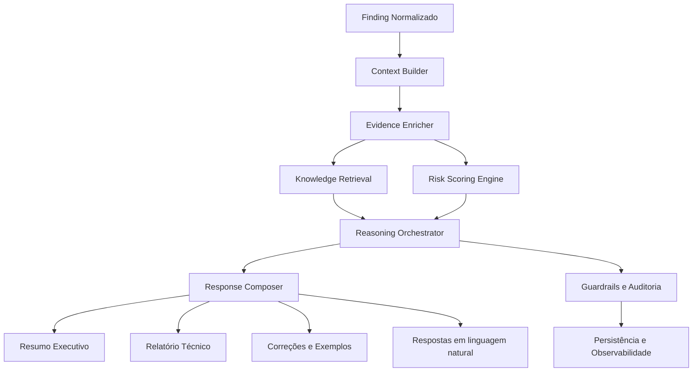

# AI Analyzer — Projeto de Arquitetura

## 1. Objetivo

O módulo AI Analyzer será responsável por transformar achados de segurança brutos em análise inteligente, contextualizada e acionável para times de segurança, desenvolvimento e operação.

Ele deve atuar como camada de interpretação semântica sobre os resultados de scanners, integrando regras determinísticas, bases de conhecimento públicas e modelos de linguagem para responder perguntas, explicar riscos, priorizar vulnerabilidades e gerar relatórios.

---

## 2. Escopo funcional

O AI Analyzer cobre as seguintes capacidades:

- Interpretar vulnerabilidades
- Explicar riscos
- Calcular prioridade
- Relacionar CVEs
- Relacionar CWEs
- Relacionar OWASP
- Explicar impacto
- Gerar resumo executivo
- Gerar relatório técnico
- Responder perguntas em linguagem natural
- Sugerir correções
- Gerar exemplos de código seguro
- Explicar falso positivo
- Explicar exploração

---

## 3. Premissas de desenho

A arquitetura do módulo deve seguir os princípios do projeto:

- Separação entre regra de negócio, orquestração de IA e infraestrutura
- Uso de dados estruturados como fonte de verdade
- Habilitar explicabilidade e rastreabilidade
- Respeitar políticas de segurança, privacidade e governança
- Haver um fluxo determinístico sempre que possível, com IA usada para interpretação e geração

---

## 4. Arquitetura lógica

### 4.1 Visão geral

O AI Analyzer será composto por cinco blocos principais:

1. Intake e contexto
2. Motor de análise de vulnerabilidades
3. Motor de conhecimento e enriquecimento
4. Motor de geração de resposta
5. Camada de governança e observabilidade



---

## 5. Componentes principais

### 5.1 Intake e contexto

Responsável por receber um finding, um scan, um contexto de projeto e metadados operacionais.

Componentes:

- AI Analyzer Service
- Finding Context Builder
- Tenant/Project Scope Resolver
- Evidence Collector
- Correlation Context

Funções:

- Agrupar evidência do scanner
- Adicionar contexto empresarial e técnico
- Normalizar entrada para o pipeline de IA

### 5.2 Motor de análise de vulnerabilidades

Responsável por interpretar a vulnerabilidade em termos técnicos e comerciais.

Componentes:

- Vulnerability Interpreter
- Risk Narrator
- Impact Analyzer
- Exploitability Analyzer
- False Positive Evaluator

Funções:

- Traduzir um finding em descrição clara de risco
- Determinar se o achado é real, plausível e explorável
- Avaliar impacto em confidencialidade, integridade e disponibilidade

### 5.3 Motor de conhecimento e enriquecimento

Responsável por correlacionar o achado com bases externas e internas.

Componentes:

- CVE Correlator
- CWE Correlator
- OWASP Correlator
- Threat Intelligence Adapter
- Policy Knowledge Base
- Remediation Knowledge Base

Funções:

- Relacionar o finding a CVEs, CWEs e categorias OWASP
- Buscar referências técnicas e mitigação
- Associar com políticas internas e padrões de governança

### 5.4 Motor de geração de resposta

Responsável por montar respostas em formatos diversos.

Componentes:

- Response Composer
- Executive Summary Generator
- Technical Report Generator
- Remediation Recommender
- Secure Code Example Generator
- Natural Language QA Layer

Funções:

- Gerar resumo executivo, relatório técnico e recomendações
- Responder perguntas em linguagem natural com base em evidência
- Sugerir correções e exemplos de código seguro

### 5.5 Governança e observabilidade

Responsável por tornar o módulo seguro, auditável e controlável.

Componentes:

- Guardrails
- Prompt Policy Engine
- Redaction Layer
- Confidence Scorer
- Audit Logger
- Cost/Latency Monitor

Funções:

- Evitar respostas inseguras ou inventadas
- Redigir conteúdo sensível com segurança
- Registrar evidências, prompts, modelos utilizados e decisões

---

## 6. Arquitetura da IA

A arquitetura da IA do módulo será híbrida, combinando:

- Regras determinísticas
- Recuperação de contexto
- LLMs para interpretação e geração
- Mecanismos de validação e rastreabilidade

### 6.1 Camada 1 — Regras determinísticas

Usada para decisões estáveis e auditáveis.

Exemplos:

- Severidade do scanner
- Criticidade do ativo
- Exposição pública
- Presença de autenticação
- Criticidade do sistema
- Política de negócio

Essa camada reduz custo e aumenta previsibilidade.

### 6.2 Camada 2 — Recuperação de contexto

Busca informação relevante antes do LLM agir.

Fontes:

- CVE database
- CWE catalog
- OWASP Top 10
- Base interna de remediações
- Histórico de achados do projeto
- Evidências do scan

Objetivo:

- Reduzir alucinação
- Evitar respostas vagarosas
- Fornecer contexto factual e atualizado

### 6.3 Camada 3 — Orquestração de modelos

Um orquestrador decide quando usar:

- modelo de classificação
- modelo de geração
- modelo de resumo
- modelo de resposta a perguntas

Padrão sugerido:

- Classificador para prioridade e risco
- LLM para explicação, relatório e recomendações
- Retriever para enriquecer contexto
- Validator para conferir consistência

### 6.4 Camada 4 — Geração estruturada

As respostas não devem ser livres. Elas devem seguir um schema explícito.

Exemplos de saída:

- RiskAnalysisResult
- PriorityAssessmentResult
- RemediationPlanResult
- ExecutiveSummaryResult
- TechnicalReportResult

Isso melhora integração com MCP, API e UI.

### 6.5 Camada 5 — Guardrails

A arquitetura deve incluir verificações obrigatórias antes e depois da geração.

Verificações:

- Se a resposta usa apenas evidências disponíveis
- Se há referências para CVE/CWE/OWASP
- Se a sugestão de correção é compatível com o stack
- Se o conteúdo não expõe dados sensíveis
- Se há confiança suficiente para publicar

---

## 7. Fluxo de execução

### 7.1 Fluxo principal

1. Recebe o finding e o contexto do scan
2. Coleta evidências e metadados
3. Enriquece com conhecimento externo e interno
4. Executa análise de risco, impacto e exploração
5. Calcula prioridade
6. Gera explicações, recomendações e relatórios
7. Publica resultados para MCP, API ou UI
8. Registra auditoria e métricas

### 7.2 Fluxo de resposta em linguagem natural

1. O usuário faz uma pergunta sobre o achado
2. O sistema monta um contexto com o finding, evidências e referências
3. O retriever busca informações relevantes
4. O LLM responde de forma objetiva e com base factual
5. O sistema adiciona fontes, confiança e próximos passos

---

## 8. Modelo de dados sugerido

### 8.1 Entidade principal

- AIAnalysis
  - analysis_id
  - finding_id
  - scan_id
  - tenant_id
  - project_id
  - status
  - confidence_score
  - risk_score
  - priority_score
  - created_at
  - updated_at

### 8.2 Subentidades

- AIAnalysisResult
  - summary
  - impact
  - exploitation
  - false_positive_assessment
  - related_cves
  - related_cwes
  - related_owasp
  - remediation_suggestions
  - executive_summary
  - technical_report

### 8.3 Evidências

- evidence_ids
- source_type
- source_reference
- retrieved_at
- confidence

---

## 9. Regras de priorização

A prioridade deve combinar:

- Severidade técnica
- Exploitabilidade
- Exposição do ativo
- Impacto de negócio
- Facilidade de correção
- Presença de compensating controls
- Contexto do ambiente

Uma abordagem prática seria:

$$
priority\_score = w_1 \cdot severity + w_2 \cdot exploitability + w_3 \cdot exposure + w_4 \cdot business\_impact + w_5 \cdot remediation\_effort
$$

Os pesos podem ser configurados por policy.

---

## 10. Estratégia de prompts

O módulo deve usar prompts com estrutura rígida, por exemplo:

- Prompt de interpretação técnica
- Prompt de cálculo de risco
- Prompt de recomendação de correção
- Prompt de resumo executivo
- Prompt de resposta a perguntas naturais

Cada prompt deve:

- Receber contexto estruturado
- Exigir resposta em JSON ou schema bem definido
- Conter instruções de segurança
- Restringir a resposta a evidências verificáveis

---

## 11. Segurança e governança

### 11.1 Segurança

- Redação de dados sensíveis antes de enviar ao modelo
- Controle de acesso por tenant e projeto
- Nenhuma execução de IA sem contexto autorizado
- Isolamento entre ambientes
- Registro de prompts, respostas e fontes

### 11.2 Governança

- Auditoria completa de decisões e justificativas
- Limites de custo e latência
- Política de retry e fallback
- Revisão humana para casos de alto impacto
- Versionamento de prompts e schemas

### 11.3 Risco de IA

Riscos a mitigar:

- Alucinação
- Resposta sem base factual
- Uso indevido de informações sensíveis
- Prompt injection
- Falta de explicabilidade

Mitigações:

- Retrieval com fontes verificáveis
- Validator pós-processamento
- Guardrails
- Confidence threshold
- Human-in-the-loop para decisões críticas

---

## 12. Integração com o ecossistema

O AI Analyzer deve ser integrado em três pontos principais:

1. MCP Server
   - Como ferramentas para análise, explicação e geração de relatório

2. Application Layer
   - Como casos de uso de análise, correlação e geração de resposta

3. UI/Console
   - Como painel de insights, explicações e recomendações

Exemplos de ferramentas MCP:

- ai_analyze_finding
- ai_explain_risk
- ai_generate_executive_summary
- ai_generate_technical_report
- ai_answer_question
- ai_suggest_remediation
- ai_generate_secure_code_example

---

## 13. Estrutura sugerida no repositório

```text
packages/
  domain/src/ai-analyzer/
    entities/
    value-objects/
    services/
    repositories/
  application/src/use-cases/ai-analyzer/
    analyze-finding/
    explain-risk/
    calculate-priority/
    correlate-knowledge/
    generate-report/
    answer-question/
  adapters/
    ai-llm/
    ai-retrieval/
    ai-knowledge/
    ai-observability/
apps/mcp-server/src/tools/ai/
apps/api-server/src/controllers/ai/
```

---

## 14. Estratégia de implementação incremental

### Fase 1

- Análise de finding
- Explicação de risco
- Cálculo de prioridade
- Relacionamento com CVE/CWE/OWASP

### Fase 2

- Resumo executivo
- Relatório técnico
- Resposta em linguagem natural

### Fase 3

- Correções sugeridas
- Exemplos de código seguro
- Avaliação de falso positivo
- Explicação de exploração

---

## 15. Conclusão

O AI Analyzer deve ser um módulo híbrido, orientado por evidência, com forte componente determinístico e uso controlado de IA generativa. A arquitetura proposta permite:

- aumentar a clareza dos achados
- reduzir o tempo de triagem
- melhorar a priorização
- apoiar remediação com sugestões concretas
- gerar relatórios executivos e técnicos com rastreabilidade

Essa combinação torna o módulo adequado para ambientes enterprise, com governança, segurança e integração nativa ao ecossistema Security QA MCP.
