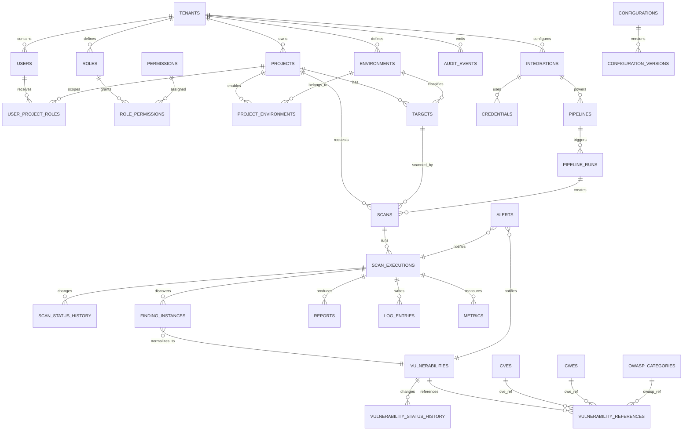

# Security QA MCP — Projeto de Banco de Dados Enterprise

## 1. Objetivo e escopo

Este documento projeta o banco de dados transacional do **Security QA MCP** para suportar operação multi tenant, rastreabilidade completa, auditoria, histórico, versionamento, soft delete, RBAC, pipelines, integrações, credenciais, logs, alertas, métricas e ciclo de vida de vulnerabilidades.

A proposta assume **PostgreSQL 16+** como banco primário de metadados, com uso complementar de object storage para artefatos grandes, evidências brutas, relatórios renderizados, screenshots, HARs, logs extensos e pacotes de auditoria. O desenho privilegia consistência, isolamento por tenant, consultas operacionais eficientes e evolução controlada por migrations.

## 2. Convenções gerais

### 2.1 Padrões de identificação

- Todas as tabelas transacionais usam `id UUID` como chave primária.
- Entidades de catálogo externo, como CVE, CWE e OWASP, usam identificadores naturais em colunas próprias e também mantêm `id UUID` para relacionamento uniforme.
- Entidades tenant-scoped possuem `tenant_id UUID NOT NULL`.
- Entidades associadas a projetos possuem `project_id UUID` quando aplicável.
- Eventos, logs e métricas incluem `correlation_id UUID` para rastreamento ponta a ponta.

### 2.2 Colunas padrão

A maioria das tabelas de domínio deve conter:

| Coluna | Tipo | Uso |
|---|---:|---|
| `id` | `UUID` | Identificador técnico global. |
| `tenant_id` | `UUID` | Isolamento multi tenant. |
| `created_at` | `TIMESTAMPTZ` | Data de criação. |
| `created_by` | `UUID` | Usuário, serviço ou integração criadora. |
| `updated_at` | `TIMESTAMPTZ` | Última alteração. |
| `updated_by` | `UUID` | Ator da última alteração. |
| `deleted_at` | `TIMESTAMPTZ NULL` | Soft delete. |
| `deleted_by` | `UUID NULL` | Ator responsável pela exclusão lógica. |
| `version` | `INTEGER` | Controle otimista de concorrência. |
| `metadata` | `JSONB` | Extensões controladas, nunca segredos em claro. |

### 2.3 Soft delete

O soft delete é implementado por `deleted_at` e `deleted_by`. Índices únicos em tabelas operacionais devem ser parciais com `WHERE deleted_at IS NULL` para permitir recriação de nomes/códigos após arquivamento lógico. Consultas padrão sempre filtram `deleted_at IS NULL`, exceto telas de auditoria e retenção.

### 2.4 Histórico e versionamento

O modelo usa três mecanismos complementares:

1. **Versionamento otimista**: coluna `version` incrementada a cada alteração.
2. **Histórico de estado**: tabelas específicas como `scan_status_history`, `vulnerability_status_history`, `pipeline_runs` e `finding_instances` preservam evolução operacional.
3. **Trilha imutável de auditoria**: `audit_events` registra ator, ação, recurso, diffs, origem, resultado e hash de integridade.

### 2.5 Multi tenant

O isolamento é feito por `tenant_id` em todas as entidades de negócio. Recomenda-se ativar **Row Level Security (RLS)** no PostgreSQL usando `current_setting('app.tenant_id')` para reforçar o isolamento no banco, além das validações da aplicação.

### 2.6 Dados sensíveis

Segredos nunca devem ser persistidos em claro. A tabela `credentials` armazena apenas ponteiros para secret managers, envelopes criptográficos, hashes e metadados de rotação. Evidências, logs e payloads devem ser mascarados antes da persistência sempre que possível.

## 3. Modelo ER conceitual



## 4. Modelo lógico

### 4.1 Identity, tenancy e permissões

| Tabela | Finalidade | Relacionamentos principais |
|---|---|---|
| `tenants` | Organização isolada consumidora da plataforma. | Pai de projetos, usuários, configurações e auditoria. |
| `users` | Identidades humanas e contas de serviço. | Pertence a tenant; recebe papéis por projeto. |
| `roles` | Papéis RBAC por tenant. | Contém permissões via `role_permissions`. |
| `permissions` | Catálogo global de ações autorizáveis. | Referenciado por papéis. |
| `role_permissions` | Associação N:N entre papéis e permissões. | Garante composição de RBAC. |
| `user_project_roles` | Associação N:N usuário/projeto/papel. | Escopo fino por projeto. |
| `api_tokens` | Tokens de serviço e automação. | Pertence a usuário ou integração. |

### 4.2 Projetos, ambientes e alvos

| Tabela | Finalidade | Relacionamentos principais |
|---|---|---|
| `projects` | Unidade de organização de aplicações, APIs ou produtos. | Pertence a tenant; possui ambientes, targets, scans e pipelines. |
| `environments` | Catálogo de ambientes, como dev, qa, staging e prod. | Pertence a tenant; usado por projetos e targets. |
| `project_environments` | Ambientes habilitados por projeto. | Associação N:N entre projeto e ambiente. |
| `targets` | Alvos autorizados para varredura. | Pertence a projeto e ambiente. |
| `target_scopes` | Regras explícitas de escopo e allowlist/denylist. | Pertence a target. |

### 4.3 Execuções, scans e plugins

| Tabela | Finalidade | Relacionamentos principais |
|---|---|---|
| `scans` | Solicitação lógica de varredura. | Pertence a projeto, target, ambiente e opcionalmente pipeline run. |
| `scan_executions` | Tentativa concreta de execução. | Pertence a scan; possui status, logs, métricas e findings. |
| `scan_status_history` | Histórico de transição de status. | Pertence a execução. |
| `plugins` | Catálogo de plugins/scanners. | Possui versões. |
| `plugin_versions` | Versões aprovadas dos plugins. | Usada pelas execuções. |
| `scan_execution_plugins` | Plugins efetivamente executados em uma execução. | Associação entre execução e versão de plugin. |

### 4.4 Vulnerabilidades, CVEs, CWEs e OWASP

| Tabela | Finalidade | Relacionamentos principais |
|---|---|---|
| `vulnerabilities` | Achado canônico deduplicado e gerenciável. | Pertence a projeto/target; recebe instâncias. |
| `finding_instances` | Ocorrência detectada em uma execução específica. | Pertence a execução e vulnerabilidade canônica. |
| `evidences` | Metadados de evidências e artefatos. | Pertence a finding instance ou vulnerabilidade. |
| `vulnerability_status_history` | Histórico do ciclo de vida da vulnerabilidade. | Pertence a vulnerabilidade. |
| `cves` | Catálogo de CVEs. | Referenciado por vulnerabilidades. |
| `cwes` | Catálogo de CWEs. | Referenciado por vulnerabilidades. |
| `owasp_categories` | Catálogo OWASP Top 10/API Top 10/ASVS. | Referenciado por vulnerabilidades. |
| `vulnerability_references` | Associação flexível entre vulnerabilidades e taxonomias. | N:N com CVE, CWE e OWASP. |

### 4.5 Relatórios, pipelines e integrações

| Tabela | Finalidade | Relacionamentos principais |
|---|---|---|
| `reports` | Relatórios técnicos, executivos e exportações. | Pertence a projeto e opcionalmente execução. |
| `pipelines` | Configurações de CI/CD. | Pertence a projeto e integração. |
| `pipeline_runs` | Execuções de pipeline que acionam scans. | Pode criar scans e gates. |
| `integrations` | Integrações com Git, CI/CD, SIEM, issue tracker e webhooks. | Pertence a tenant/projeto. |
| `integration_events` | Eventos enviados/recebidos por integração. | Pertence a integração. |

### 4.6 Configurações, credenciais, observabilidade e compliance

| Tabela | Finalidade | Relacionamentos principais |
|---|---|---|
| `configurations` | Configurações tenant/projeto/policy. | Possui versões. |
| `configuration_versions` | Histórico versionado de configurações. | Pertence a configuração. |
| `credentials` | Referências a credenciais protegidas. | Usada por integrações, pipelines e plugins. |
| `log_entries` | Logs operacionais indexáveis. | Relacionados a tenant/projeto/execução. |
| `metrics` | Métricas técnicas e de segurança. | Relacionadas a tenant/projeto/execução. |
| `alerts` | Alertas operacionais, segurança e compliance. | Relacionados a vulnerabilidades, execuções ou integrações. |
| `audit_events` | Auditoria imutável de ações relevantes. | Relaciona ator e recurso afetado. |
| `domain_events` | Outbox/eventos de domínio para integração assíncrona. | Garante publicação confiável. |

## 5. Modelo físico proposto

### 5.1 Tipos enumerados

```sql
CREATE TYPE user_kind AS ENUM ('human', 'service_account');
CREATE TYPE target_kind AS ENUM ('web', 'api_rest', 'api_graphql', 'openapi', 'host');
CREATE TYPE environment_kind AS ENUM ('dev', 'qa', 'staging', 'prod', 'sandbox', 'custom');
CREATE TYPE scan_status AS ENUM ('requested', 'queued', 'running', 'canceling', 'canceled', 'succeeded', 'failed', 'timed_out');
CREATE TYPE severity_level AS ENUM ('info', 'low', 'medium', 'high', 'critical');
CREATE TYPE vulnerability_status AS ENUM ('new', 'triage', 'accepted_risk', 'in_progress', 'fixed', 'false_positive', 'reopened', 'closed');
CREATE TYPE report_kind AS ENUM ('technical', 'executive', 'sarif', 'json', 'html', 'audit_package');
CREATE TYPE integration_kind AS ENUM ('git', 'ci_cd', 'issue_tracker', 'siem', 'webhook', 'mcp_client', 'observability');
CREATE TYPE alert_status AS ENUM ('open', 'acknowledged', 'resolved', 'suppressed');
CREATE TYPE audit_result AS ENUM ('success', 'failure', 'denied');
```

### 5.2 DDL resumido das tabelas centrais

> O DDL abaixo é intencionalmente enxuto para orientar migrations. Campos `metadata JSONB`, timestamps, versionamento, soft delete e índices parciais devem ser padronizados por templates de migration.

```sql
CREATE TABLE tenants (
  id UUID PRIMARY KEY,
  slug TEXT NOT NULL,
  name TEXT NOT NULL,
  status TEXT NOT NULL DEFAULT 'active',
  settings JSONB NOT NULL DEFAULT '{}',
  created_at TIMESTAMPTZ NOT NULL DEFAULT now(),
  updated_at TIMESTAMPTZ NOT NULL DEFAULT now(),
  deleted_at TIMESTAMPTZ,
  version INTEGER NOT NULL DEFAULT 1,
  CONSTRAINT uq_tenants_slug_active UNIQUE (slug)
);

CREATE TABLE users (
  id UUID PRIMARY KEY,
  tenant_id UUID NOT NULL REFERENCES tenants(id),
  email CITEXT NOT NULL,
  display_name TEXT NOT NULL,
  kind user_kind NOT NULL DEFAULT 'human',
  external_subject TEXT,
  status TEXT NOT NULL DEFAULT 'active',
  last_login_at TIMESTAMPTZ,
  created_at TIMESTAMPTZ NOT NULL DEFAULT now(),
  updated_at TIMESTAMPTZ NOT NULL DEFAULT now(),
  deleted_at TIMESTAMPTZ,
  version INTEGER NOT NULL DEFAULT 1
);

CREATE TABLE projects (
  id UUID PRIMARY KEY,
  tenant_id UUID NOT NULL REFERENCES tenants(id),
  key TEXT NOT NULL,
  name TEXT NOT NULL,
  description TEXT,
  business_criticality severity_level NOT NULL DEFAULT 'medium',
  owner_user_id UUID REFERENCES users(id),
  status TEXT NOT NULL DEFAULT 'active',
  created_at TIMESTAMPTZ NOT NULL DEFAULT now(),
  updated_at TIMESTAMPTZ NOT NULL DEFAULT now(),
  deleted_at TIMESTAMPTZ,
  version INTEGER NOT NULL DEFAULT 1
);

CREATE TABLE environments (
  id UUID PRIMARY KEY,
  tenant_id UUID NOT NULL REFERENCES tenants(id),
  code TEXT NOT NULL,
  name TEXT NOT NULL,
  kind environment_kind NOT NULL,
  requires_approval BOOLEAN NOT NULL DEFAULT false,
  scan_window JSONB NOT NULL DEFAULT '{}',
  created_at TIMESTAMPTZ NOT NULL DEFAULT now(),
  updated_at TIMESTAMPTZ NOT NULL DEFAULT now(),
  deleted_at TIMESTAMPTZ,
  version INTEGER NOT NULL DEFAULT 1
);

CREATE TABLE targets (
  id UUID PRIMARY KEY,
  tenant_id UUID NOT NULL REFERENCES tenants(id),
  project_id UUID NOT NULL REFERENCES projects(id),
  environment_id UUID NOT NULL REFERENCES environments(id),
  kind target_kind NOT NULL,
  name TEXT NOT NULL,
  base_url TEXT,
  openapi_document_uri TEXT,
  owner_user_id UUID REFERENCES users(id),
  authorization_status TEXT NOT NULL DEFAULT 'authorized',
  tags TEXT[] NOT NULL DEFAULT '{}',
  created_at TIMESTAMPTZ NOT NULL DEFAULT now(),
  updated_at TIMESTAMPTZ NOT NULL DEFAULT now(),
  deleted_at TIMESTAMPTZ,
  version INTEGER NOT NULL DEFAULT 1
);

CREATE TABLE scans (
  id UUID PRIMARY KEY,
  tenant_id UUID NOT NULL REFERENCES tenants(id),
  project_id UUID NOT NULL REFERENCES projects(id),
  target_id UUID NOT NULL REFERENCES targets(id),
  environment_id UUID NOT NULL REFERENCES environments(id),
  pipeline_run_id UUID,
  requested_by UUID REFERENCES users(id),
  status scan_status NOT NULL DEFAULT 'requested',
  profile TEXT NOT NULL,
  idempotency_key TEXT,
  request_payload JSONB NOT NULL DEFAULT '{}',
  created_at TIMESTAMPTZ NOT NULL DEFAULT now(),
  updated_at TIMESTAMPTZ NOT NULL DEFAULT now(),
  deleted_at TIMESTAMPTZ,
  version INTEGER NOT NULL DEFAULT 1
);

CREATE TABLE scan_executions (
  id UUID PRIMARY KEY,
  tenant_id UUID NOT NULL REFERENCES tenants(id),
  scan_id UUID NOT NULL REFERENCES scans(id),
  attempt_number INTEGER NOT NULL,
  status scan_status NOT NULL,
  worker_id TEXT,
  correlation_id UUID NOT NULL,
  started_at TIMESTAMPTZ,
  finished_at TIMESTAMPTZ,
  duration_ms BIGINT,
  error_code TEXT,
  error_message TEXT,
  created_at TIMESTAMPTZ NOT NULL DEFAULT now(),
  updated_at TIMESTAMPTZ NOT NULL DEFAULT now(),
  version INTEGER NOT NULL DEFAULT 1
);

CREATE TABLE vulnerabilities (
  id UUID PRIMARY KEY,
  tenant_id UUID NOT NULL REFERENCES tenants(id),
  project_id UUID NOT NULL REFERENCES projects(id),
  target_id UUID NOT NULL REFERENCES targets(id),
  environment_id UUID REFERENCES environments(id),
  fingerprint TEXT NOT NULL,
  title TEXT NOT NULL,
  description TEXT NOT NULL,
  severity severity_level NOT NULL,
  status vulnerability_status NOT NULL DEFAULT 'new',
  first_seen_at TIMESTAMPTZ NOT NULL,
  last_seen_at TIMESTAMPTZ NOT NULL,
  fixed_at TIMESTAMPTZ,
  sla_due_at TIMESTAMPTZ,
  cvss_score NUMERIC(3,1),
  remediation TEXT,
  created_at TIMESTAMPTZ NOT NULL DEFAULT now(),
  updated_at TIMESTAMPTZ NOT NULL DEFAULT now(),
  deleted_at TIMESTAMPTZ,
  version INTEGER NOT NULL DEFAULT 1
);

CREATE TABLE finding_instances (
  id UUID PRIMARY KEY,
  tenant_id UUID NOT NULL REFERENCES tenants(id),
  scan_execution_id UUID NOT NULL REFERENCES scan_executions(id),
  vulnerability_id UUID REFERENCES vulnerabilities(id),
  plugin_version_id UUID,
  raw_finding_hash TEXT NOT NULL,
  location JSONB NOT NULL DEFAULT '{}',
  evidence_summary TEXT,
  confidence TEXT NOT NULL DEFAULT 'medium',
  severity severity_level NOT NULL,
  detected_at TIMESTAMPTZ NOT NULL DEFAULT now(),
  normalized_payload JSONB NOT NULL DEFAULT '{}'
);

CREATE TABLE cves (
  id UUID PRIMARY KEY,
  cve_id TEXT NOT NULL UNIQUE,
  title TEXT,
  description TEXT,
  cvss_v3_score NUMERIC(3,1),
  published_at TIMESTAMPTZ,
  modified_at TIMESTAMPTZ,
  source JSONB NOT NULL DEFAULT '{}'
);

CREATE TABLE cwes (
  id UUID PRIMARY KEY,
  cwe_id TEXT NOT NULL UNIQUE,
  name TEXT NOT NULL,
  description TEXT,
  abstraction TEXT,
  status TEXT
);

CREATE TABLE owasp_categories (
  id UUID PRIMARY KEY,
  standard TEXT NOT NULL,
  version TEXT NOT NULL,
  category_code TEXT NOT NULL,
  name TEXT NOT NULL,
  description TEXT,
  UNIQUE (standard, version, category_code)
);

CREATE TABLE reports (
  id UUID PRIMARY KEY,
  tenant_id UUID NOT NULL REFERENCES tenants(id),
  project_id UUID NOT NULL REFERENCES projects(id),
  scan_execution_id UUID REFERENCES scan_executions(id),
  kind report_kind NOT NULL,
  title TEXT NOT NULL,
  artifact_uri TEXT NOT NULL,
  checksum_sha256 TEXT NOT NULL,
  generated_by UUID REFERENCES users(id),
  generated_at TIMESTAMPTZ NOT NULL DEFAULT now(),
  expires_at TIMESTAMPTZ,
  filters JSONB NOT NULL DEFAULT '{}',
  deleted_at TIMESTAMPTZ
);

CREATE TABLE audit_events (
  id UUID PRIMARY KEY,
  tenant_id UUID REFERENCES tenants(id),
  actor_user_id UUID REFERENCES users(id),
  actor_type TEXT NOT NULL,
  action TEXT NOT NULL,
  resource_type TEXT NOT NULL,
  resource_id UUID,
  result audit_result NOT NULL,
  ip_address INET,
  user_agent TEXT,
  correlation_id UUID,
  before_data JSONB,
  after_data JSONB,
  diff JSONB,
  integrity_hash TEXT NOT NULL,
  occurred_at TIMESTAMPTZ NOT NULL DEFAULT now()
);
```

## 6. Tabelas detalhadas

### 6.1 `tenants`

Representa a fronteira máxima de isolamento de dados. Cada tenant possui usuários, projetos, ambientes, integrações, configurações e trilhas de auditoria próprias. É a tabela raiz de quase todos os relacionamentos.

- **Chave primária**: `id`.
- **Chaves únicas**: `slug` para identificação amigável.
- **Constraints**: `status` limitado a estados operacionais definidos por domínio.
- **Índices**: `idx_tenants_status`, `idx_tenants_deleted_at`.
- **Auditoria**: alterações geram eventos `tenant.created`, `tenant.updated`, `tenant.disabled`.
- **Soft delete**: permitido apenas quando não houver execuções retidas obrigatoriamente por compliance.

### 6.2 `users`

Armazena usuários humanos e contas de serviço dentro de um tenant. Não armazena senha quando houver provedor de identidade externo; nesse caso `external_subject` identifica o usuário no IdP.

- **Chave primária**: `id`.
- **FKs**: `tenant_id` para `tenants`.
- **Chaves únicas**: `(tenant_id, email)` parcial para usuários ativos.
- **Índices**: `idx_users_tenant_status`, `idx_users_external_subject`.
- **Relacionamentos**: N:N com projetos e papéis via `user_project_roles`.
- **Auditoria**: login, criação, desativação e mudança de papéis devem ser auditados.

### 6.3 `roles`, `permissions`, `role_permissions`

Compõem o RBAC. `permissions` é catálogo global de ações, `roles` define agrupamentos por tenant e `role_permissions` associa permissões aos papéis.

- **Chaves**: `roles.id`, `permissions.id`; associação por PK composta `(role_id, permission_id)`.
- **Constraints**: `permissions.code` único, por exemplo `scan:create`, `finding:update`, `report:export`.
- **Índices**: `idx_roles_tenant`, `idx_role_permissions_permission`.
- **Versionamento**: alterações em papéis incrementam `roles.version` e registram auditoria com diff.

### 6.4 `user_project_roles`

Define acesso efetivo do usuário a projetos específicos. Permite que o mesmo usuário tenha papel de administrador em um projeto e papel somente leitura em outro.

- **PK composta recomendada**: `(tenant_id, user_id, project_id, role_id)`.
- **FKs**: `users`, `projects`, `roles`.
- **Constraints**: tenant do usuário, projeto e papel deve ser o mesmo.
- **Índices**: `idx_upr_user`, `idx_upr_project`, `idx_upr_role`.
- **Auditoria**: concessão e revogação são eventos críticos.

### 6.5 `api_tokens`

Registra tokens de API e automação. O segredo completo nunca é armazenado; persistem apenas hash, prefixo público, escopos e expiração.

- **FKs**: `tenant_id`, `user_id`, opcionalmente `integration_id`.
- **Constraints**: `expires_at > created_at`, hash único.
- **Índices**: `idx_api_tokens_tenant_active`, `idx_api_tokens_hash`.
- **Histórico**: rotação e revogação geram eventos em `audit_events`.

### 6.6 `projects`

Representa uma aplicação, API, produto ou domínio técnico a ser protegido. É o principal agrupador de targets, scans, vulnerabilidades, relatórios e pipelines.

- **FKs**: `tenant_id`, `owner_user_id`.
- **Chaves únicas**: `(tenant_id, key)` parcial para ativos.
- **Índices**: `idx_projects_tenant_status`, `idx_projects_owner`.
- **Soft delete**: arquiva o projeto sem remover histórico regulatório.
- **Relacionamentos**: 1:N com `targets`, `scans`, `vulnerabilities`, `reports`, `pipelines`.

### 6.7 `environments` e `project_environments`

`environments` define ambientes por tenant; `project_environments` habilita quais ambientes existem para cada projeto e permite configurações específicas.

- **Chaves únicas**: `(tenant_id, code)` em `environments`; `(project_id, environment_id)` em `project_environments`.
- **Constraints**: produção pode exigir `requires_approval = true`.
- **Índices**: `idx_env_tenant_kind`, `idx_project_env_project`.
- **Uso**: controla janelas, intensidade de scan e regras de aprovação.

### 6.8 `targets` e `target_scopes`

`targets` armazena URLs, APIs, hosts ou contratos autorizados. `target_scopes` detalha allowlists, denylists, paths, métodos HTTP, domínios e limites de execução.

- **FKs**: `project_id`, `environment_id`, `owner_user_id`.
- **Chaves únicas**: `(tenant_id, project_id, environment_id, kind, base_url)` parcial para ativos.
- **Constraints**: `base_url` obrigatório para alvos web/API; `openapi_document_uri` obrigatório para OpenAPI quando aplicável.
- **Índices**: `idx_targets_project_env`, GIN em `tags`, trigram opcional em `base_url`.
- **Auditoria**: alteração de escopo é crítica e deve registrar before/after.

### 6.9 `scans`

Representa a intenção de executar uma varredura. Um scan pode ser criado por API, MCP, CLI, agendamento ou pipeline.

- **FKs**: `project_id`, `target_id`, `environment_id`, `pipeline_run_id`, `requested_by`.
- **Chaves únicas**: `(tenant_id, idempotency_key)` parcial quando `idempotency_key IS NOT NULL`.
- **Índices**: `idx_scans_project_status_created`, `idx_scans_target_created`, `idx_scans_pipeline_run`.
- **Constraints**: target, projeto e ambiente devem pertencer ao mesmo tenant.
- **Histórico**: status resumido no registro; transições detalhadas em `scan_status_history`.

### 6.10 `scan_executions`

Representa uma tentativa concreta de execução do scan, incluindo retentativas. Permite distinguir a solicitação lógica das execuções reais em workers.

- **FKs**: `scan_id`, `tenant_id`.
- **Chaves únicas**: `(scan_id, attempt_number)`.
- **Índices**: `idx_scan_exec_status_started`, `idx_scan_exec_correlation`, `idx_scan_exec_tenant_created`.
- **Constraints**: `finished_at >= started_at`, `duration_ms >= 0`.
- **Relacionamentos**: 1:N com plugins executados, findings, logs, métricas e relatórios.

### 6.11 `scan_status_history`

Preserva todas as mudanças de estado de uma execução. É essencial para auditoria, troubleshooting e SLAs.

- **FKs**: `scan_execution_id`, `changed_by`.
- **Campos principais**: `from_status`, `to_status`, `reason`, `occurred_at`.
- **Índices**: `idx_scan_status_history_execution_time`.
- **Constraints**: `from_status <> to_status` quando `from_status` não for nulo.
- **Retenção**: deve seguir política de compliance do tenant.

### 6.12 `plugins`, `plugin_versions`, `scan_execution_plugins`

Modelam o catálogo de scanners/plugins, suas versões aprovadas e a execução efetiva em cada scan.

- **Chaves únicas**: `plugins.slug`; `(plugin_id, semantic_version)` em `plugin_versions`.
- **Constraints**: versão aprovada e assinatura válida para execução em ambientes restritos.
- **Índices**: `idx_plugin_versions_status`, `idx_scan_exec_plugins_execution`.
- **Auditoria**: publicação, aprovação, revogação e alteração de permissões de plugins são críticas.

### 6.13 `vulnerabilities`

É o registro canônico deduplicado de vulnerabilidade. Consolida múltiplas detecções equivalentes ao longo do tempo, permitindo SLA, status, aceitação de risco e remediação.

- **FKs**: `project_id`, `target_id`, `environment_id`.
- **Chaves únicas**: `(tenant_id, project_id, target_id, fingerprint)` parcial para ativos.
- **Índices**: `idx_vuln_project_status_severity`, `idx_vuln_sla_due`, `idx_vuln_last_seen`.
- **Constraints**: `cvss_score BETWEEN 0 AND 10`, `last_seen_at >= first_seen_at`.
- **Histórico**: mudanças de status em `vulnerability_status_history`.
- **Soft delete**: usado para arquivamento lógico, preservando auditoria.

### 6.14 `finding_instances`

Representa uma ocorrência específica detectada por um plugin em uma execução. Mantém payload normalizado e vínculo com a vulnerabilidade canônica.

- **FKs**: `scan_execution_id`, `vulnerability_id`, `plugin_version_id`.
- **Chaves únicas**: `(scan_execution_id, raw_finding_hash)`.
- **Índices**: `idx_finding_instances_vulnerability`, GIN em `location` e `normalized_payload`.
- **Uso**: permite análise de reincidência, falsos positivos por execução e evidências pontuais.

### 6.15 `evidences`

Armazena metadados de evidências. O conteúdo pesado fica em object storage, referenciado por `artifact_uri` e protegido por checksum.

- **FKs**: `finding_instance_id`, `vulnerability_id`, `scan_execution_id`.
- **Campos principais**: `kind`, `artifact_uri`, `checksum_sha256`, `redaction_status`, `content_type`, `size_bytes`.
- **Constraints**: checksum obrigatório; evidência imutável após criada.
- **Índices**: `idx_evidences_finding`, `idx_evidences_vulnerability`, `idx_evidences_checksum`.
- **Auditoria**: acesso e exportação de evidência sensível devem ser registrados.

### 6.16 `cves`

Catálogo de vulnerabilidades públicas CVE. Deve ser sincronizado por job controlado e versionado conforme a fonte oficial utilizada.

- **Chave natural**: `cve_id` único, por exemplo `CVE-2026-0001`.
- **Índices**: `idx_cves_published`, `idx_cves_cvss`.
- **Histórico**: alterações relevantes podem ser registradas em tabela de snapshots se a organização exigir reprodutibilidade completa.

### 6.17 `cwes`

Catálogo de fraquezas CWE. Apoia classificação, recomendação e relatórios executivos.

- **Chave natural**: `cwe_id` único, por exemplo `CWE-79`.
- **Índices**: `idx_cwes_name`, full-text opcional em `description`.
- **Relacionamentos**: N:N com vulnerabilidades via `vulnerability_references`.

### 6.18 `owasp_categories`

Catálogo de categorias OWASP, incluindo Top 10 Web, API Top 10 e ASVS, por versão.

- **Chave única**: `(standard, version, category_code)`.
- **Índices**: `idx_owasp_standard_version`.
- **Uso**: relatórios por risco OWASP e mapeamentos de compliance.

### 6.19 `vulnerability_references`

Associação flexível entre vulnerabilidades e referências CVE, CWE, OWASP ou links externos.

- **FKs opcionais**: `cve_id`, `cwe_id`, `owasp_category_id`.
- **Constraints**: ao menos uma referência deve estar preenchida.
- **Índices**: `idx_vuln_refs_vulnerability`, `idx_vuln_refs_cve`, `idx_vuln_refs_cwe`, `idx_vuln_refs_owasp`.
- **Uso**: evita colunas repetidas em `vulnerabilities` e permite múltiplas taxonomias.

### 6.20 `vulnerability_status_history`

Registra cada transição de status da vulnerabilidade com justificativa, ator e prazo quando aplicável.

- **FKs**: `vulnerability_id`, `changed_by`.
- **Campos principais**: `from_status`, `to_status`, `reason`, `expires_at`, `approval_user_id`.
- **Constraints**: aceitação de risco exige `reason` e `expires_at`.
- **Índices**: `idx_vuln_status_history_vuln_time`, `idx_vuln_status_history_expiration`.

### 6.21 `reports`

Registra relatórios gerados e seus metadados. O artefato final é armazenado fora do banco.

- **FKs**: `project_id`, `scan_execution_id`, `generated_by`.
- **Constraints**: `checksum_sha256` obrigatório; `artifact_uri` obrigatório.
- **Índices**: `idx_reports_project_kind_generated`, `idx_reports_scan_execution`.
- **Soft delete**: remove da navegação, mas mantém retenção conforme política.

### 6.22 `pipelines` e `pipeline_runs`

`pipelines` define integrações CI/CD por projeto; `pipeline_runs` representa execuções concretas que podem criar scans e quality gates.

- **FKs**: `project_id`, `integration_id`, `credential_id` quando necessário.
- **Chaves únicas**: `(tenant_id, project_id, external_pipeline_id)`.
- **Índices**: `idx_pipeline_runs_commit`, `idx_pipeline_runs_status_started`.
- **Uso**: correlaciona build, branch, commit, scan e decisão de gate.

### 6.23 `integrations` e `integration_events`

Modelam conexões externas com Git, CI/CD, SIEM, issue trackers, webhooks, observabilidade e clientes MCP.

- **FKs**: `tenant_id`, opcional `project_id`, `credential_id`.
- **Constraints**: endpoint válido e tipo permitido.
- **Índices**: `idx_integrations_tenant_kind`, `idx_integration_events_status_time`.
- **Auditoria**: falhas, retries e payloads devem ser mascarados.

### 6.24 `configurations` e `configuration_versions`

Guardam políticas, thresholds, perfis de scan, janelas, retenção e parâmetros por tenant/projeto.

- **Chaves únicas**: `(tenant_id, scope_type, scope_id, key)` parcial para configuração ativa.
- **Versionamento**: `configuration_versions` armazena snapshot completo, número de versão, autor e motivo.
- **Índices**: `idx_config_scope_key`, `idx_config_versions_config_version`.
- **Auditoria**: toda alteração de policy e retenção deve ser auditada.

### 6.25 `credentials`

Registra referências seguras a credenciais. Pode apontar para Vault, AWS Secrets Manager, GCP Secret Manager, Azure Key Vault ou envelope criptografado gerenciado.

- **Campos principais**: `provider`, `secret_ref`, `public_fingerprint`, `last_rotated_at`, `expires_at`, `rotation_policy`.
- **Constraints**: `secret_ref` obrigatório; segredo em claro proibido.
- **Índices**: `idx_credentials_tenant_provider`, `idx_credentials_expiration`.
- **Auditoria**: criação, uso privilegiado, rotação e revogação são eventos sensíveis.

### 6.26 `log_entries`

Logs estruturados para consulta operacional. Logs volumosos devem ser enviados para stack externa; esta tabela mantém eventos importantes e links para blobs.

- **FKs**: `tenant_id`, `project_id`, `scan_execution_id`.
- **Campos principais**: `level`, `message`, `logger`, `correlation_id`, `trace_id`, `attributes`.
- **Índices**: `idx_logs_tenant_time`, `idx_logs_correlation`, GIN em `attributes`.
- **Particionamento**: recomendado por mês em `occurred_at`.

### 6.27 `metrics`

Métricas agregadas ou pontuais de execução, segurança e operação. Para alta cardinalidade, Prometheus/TSDB deve ser a fonte primária; esta tabela retém snapshots úteis para relatórios.

- **Campos principais**: `metric_name`, `metric_value`, `unit`, `dimensions JSONB`, `measured_at`.
- **Índices**: `idx_metrics_name_time`, `idx_metrics_tenant_project_time`, GIN em `dimensions`.
- **Particionamento**: recomendado por tempo.

### 6.28 `alerts`

Alertas gerados por vulnerabilidades críticas, falhas operacionais, SLA vencido, integração indisponível ou anomalias.

- **FKs opcionais**: `vulnerability_id`, `scan_execution_id`, `integration_id`.
- **Constraints**: pelo menos um recurso relacionado ou `scope_type/scope_id` deve existir.
- **Índices**: `idx_alerts_status_severity`, `idx_alerts_tenant_created`.
- **Histórico**: mudanças de status podem ser auditadas ou registradas em `alert_history` se o volume justificar.

### 6.29 `audit_events`

Trilha imutável de auditoria. Deve registrar ações administrativas, operacionais e de segurança, incluindo tentativas negadas.

- **FKs**: `tenant_id`, `actor_user_id` quando aplicável.
- **Campos principais**: `action`, `resource_type`, `resource_id`, `result`, `before_data`, `after_data`, `diff`, `integrity_hash`.
- **Índices**: `idx_audit_tenant_time`, `idx_audit_actor_time`, `idx_audit_resource`, `idx_audit_correlation`.
- **Integridade**: pode usar cadeia de hashes por tenant/período para detectar adulteração.
- **Retenção**: política mais rígida que logs comuns.

### 6.30 `domain_events`

Implementa outbox pattern para publicação confiável de eventos assíncronos.

- **Campos principais**: `event_type`, `aggregate_type`, `aggregate_id`, `payload`, `schema_version`, `status`, `published_at`, `retry_count`.
- **Índices**: `idx_domain_events_status_created`, `idx_domain_events_aggregate`.
- **Constraints**: `schema_version` obrigatório para evolução compatível.

## 7. Índices recomendados

```sql
CREATE UNIQUE INDEX uq_users_tenant_email_active
  ON users (tenant_id, email) WHERE deleted_at IS NULL;

CREATE UNIQUE INDEX uq_projects_tenant_key_active
  ON projects (tenant_id, key) WHERE deleted_at IS NULL;

CREATE UNIQUE INDEX uq_targets_active_identity
  ON targets (tenant_id, project_id, environment_id, kind, base_url)
  WHERE deleted_at IS NULL AND base_url IS NOT NULL;

CREATE UNIQUE INDEX uq_scans_idempotency
  ON scans (tenant_id, idempotency_key)
  WHERE idempotency_key IS NOT NULL AND deleted_at IS NULL;

CREATE UNIQUE INDEX uq_scan_execution_attempt
  ON scan_executions (scan_id, attempt_number);

CREATE UNIQUE INDEX uq_vulnerability_fingerprint_active
  ON vulnerabilities (tenant_id, project_id, target_id, fingerprint)
  WHERE deleted_at IS NULL;

CREATE INDEX idx_scans_project_status_created
  ON scans (tenant_id, project_id, status, created_at DESC);

CREATE INDEX idx_scan_exec_correlation
  ON scan_executions (correlation_id);

CREATE INDEX idx_vuln_project_status_severity
  ON vulnerabilities (tenant_id, project_id, status, severity, updated_at DESC);

CREATE INDEX idx_vuln_sla_due
  ON vulnerabilities (tenant_id, sla_due_at) WHERE status NOT IN ('fixed', 'closed', 'false_positive');

CREATE INDEX idx_finding_instances_vulnerability
  ON finding_instances (vulnerability_id, detected_at DESC);

CREATE INDEX idx_reports_project_kind_generated
  ON reports (tenant_id, project_id, kind, generated_at DESC);

CREATE INDEX idx_audit_tenant_time
  ON audit_events (tenant_id, occurred_at DESC);

CREATE INDEX idx_audit_resource
  ON audit_events (resource_type, resource_id, occurred_at DESC);

CREATE INDEX idx_logs_correlation
  ON log_entries (correlation_id, occurred_at DESC);

CREATE INDEX idx_metrics_name_time
  ON metrics (tenant_id, metric_name, measured_at DESC);

CREATE INDEX idx_config_versions_config_version
  ON configuration_versions (configuration_id, version_number DESC);
```

## 8. Constraints e regras de integridade

- Toda entidade tenant-scoped deve ter FK para `tenants` e validar que relacionamentos cruzados pertencem ao mesmo tenant.
- `scans.target_id`, `scans.project_id` e `scans.environment_id` devem ser coerentes com o mesmo target.
- `scan_executions.attempt_number` deve ser positivo.
- `duration_ms` não pode ser negativo.
- `cvss_score` deve estar entre 0 e 10.
- `last_seen_at` não pode ser menor que `first_seen_at`.
- Aceitação de risco em `vulnerability_status_history` exige justificativa, aprovador e expiração.
- Evidências são imutáveis: atualizações devem criar novo registro/versionamento, não sobrescrever o artefato.
- Credenciais não podem conter segredo em claro; apenas `secret_ref`, hash/fingerprint e metadados.
- Soft delete deve ser bloqueado quando violar retenção legal ou trilha de auditoria obrigatória.

## 9. Chaves e relacionamentos principais

| Origem | Destino | Cardinalidade | Observação |
|---|---|---:|---|
| `tenants` | `projects` | 1:N | Tenant possui projetos. |
| `tenants` | `users` | 1:N | Usuários pertencem a tenant. |
| `projects` | `targets` | 1:N | Projeto contém alvos autorizados. |
| `environments` | `targets` | 1:N | Target é classificado por ambiente. |
| `projects` | `scans` | 1:N | Projeto solicita scans. |
| `targets` | `scans` | 1:N | Target é varrido por scans. |
| `scans` | `scan_executions` | 1:N | Scan pode ter retentativas. |
| `scan_executions` | `finding_instances` | 1:N | Execução detecta ocorrências. |
| `vulnerabilities` | `finding_instances` | 1:N | Vulnerabilidade canônica consolida ocorrências. |
| `vulnerabilities` | `vulnerability_references` | 1:N | Achado mapeia CVE/CWE/OWASP. |
| `scan_executions` | `reports` | 1:N | Execução pode gerar múltiplos formatos. |
| `integrations` | `pipelines` | 1:N | Integração sustenta pipelines. |
| `pipelines` | `pipeline_runs` | 1:N | Pipeline possui execuções. |
| `pipeline_runs` | `scans` | 1:N | Uma execução de pipeline pode criar vários scans. |

## 10. Auditoria

A auditoria deve ser orientada por eventos imutáveis. Cada ação relevante registra:

- Ator: usuário humano, service account, pipeline ou integração.
- Contexto: tenant, projeto, IP, user agent, origem, `correlation_id`.
- Recurso: tipo, identificador e versão.
- Resultado: sucesso, falha ou negado.
- Mudança: `before_data`, `after_data` e `diff` mascarados.
- Integridade: `integrity_hash` calculado a partir do conteúdo e hash anterior opcional.

Eventos mínimos auditáveis:

- Criação, alteração, arquivamento e restauração de projeto, target e ambiente.
- Criação, cancelamento, retentativa e finalização de scan.
- Alteração de status de vulnerabilidade e aceitação de risco.
- Geração, exportação e download de relatório/evidência sensível.
- Criação, alteração, rotação e revogação de credenciais e tokens.
- Mudança em RBAC, permissões, configurações e policies.
- Registro, aprovação, revogação e execução de plugins intrusivos.
- Falhas de autenticação, autorização negada e uso anômalo de integração.

## 11. Histórico

O histórico operacional é separado por tipo de dado:

- **Status de scans**: `scan_status_history` registra cada transição de execução.
- **Status de vulnerabilidades**: `vulnerability_status_history` registra triagem, aceite, correção, falso positivo e reabertura.
- **Configurações**: `configuration_versions` mantém snapshot completo de cada alteração.
- **Execuções de pipeline**: `pipeline_runs` preserva commit, branch, build, gate e resultado.
- **Auditoria transversal**: `audit_events` preserva ações humanas e sistêmicas relevantes.
- **Eventos de domínio**: `domain_events` registra publicação e retry de eventos assíncronos.

## 12. Versionamento

O versionamento é aplicado em camadas:

1. **Linha atual**: coluna `version` para concorrência otimista.
2. **Snapshots de configuração**: `configuration_versions.version_number` guarda cada política publicada.
3. **Contratos de eventos**: `domain_events.schema_version` e eventos externos versionados.
4. **Plugins**: `plugin_versions.semantic_version` e status de aprovação.
5. **Relatórios**: cada geração cria um novo `reports.id` com checksum e filtros usados.

## 13. Multi tenant e Row Level Security

Exemplo de política RLS para tabelas tenant-scoped:

```sql
ALTER TABLE projects ENABLE ROW LEVEL SECURITY;

CREATE POLICY tenant_isolation_projects ON projects
USING (tenant_id = current_setting('app.tenant_id')::uuid);
```

Recomendações:

- Definir `app.tenant_id` no início de cada transação.
- Nunca confiar apenas no filtro da aplicação.
- Incluir `tenant_id` em índices compostos de consultas frequentes.
- Impedir FK cruzada entre tenants por constraints ou triggers de validação.
- Separar workloads regulatórios extremos por schema ou database dedicado quando exigido por contrato.

## 14. Particionamento e retenção

Tabelas de alto volume devem ser particionadas por tempo e, quando necessário, por tenant:

| Tabela | Estratégia | Retenção sugerida |
|---|---|---:|
| `audit_events` | Partição mensal por `occurred_at` | 5 a 10 anos conforme compliance. |
| `log_entries` | Partição diária ou mensal por `occurred_at` | 30 a 180 dias no banco. |
| `metrics` | Partição mensal por `measured_at` | 13 a 25 meses para tendência. |
| `domain_events` | Partição mensal por `created_at` | 90 a 365 dias após publicação. |
| `finding_instances` | Partição por `detected_at` em tenants grandes | Conforme retenção de segurança. |

Artefatos em object storage devem ter lifecycle policies próprias com retenção legal, criptografia e bloqueio de exclusão quando necessário.

## 15. Segurança do banco

- TLS obrigatório entre aplicação e banco.
- Criptografia em repouso no volume gerenciado.
- RLS habilitado nas tabelas multi tenant críticas.
- Princípio de menor privilégio por role técnica: app read/write, migration, readonly analytics, auditoria.
- Mascaramento de payloads sensíveis antes de persistir logs e evidências.
- Colunas `JSONB` com validação por aplicação e, para payloads críticos, `CHECK` com JSON Schema via extensão ou validação em pipeline.
- Backups criptografados, testados e com restauração periodicamente validada.

## 16. Observações de implementação

- Migrations devem criar primeiro tipos, tabelas raiz, catálogos, tabelas transacionais, índices, triggers e políticas RLS.
- Triggers podem atualizar `updated_at`, incrementar `version` e impedir alteração de evidências imutáveis.
- A aplicação deve publicar eventos via outbox em `domain_events` na mesma transação das mudanças de estado.
- Consultas analíticas pesadas devem usar réplicas, materialized views ou data warehouse para não impactar execução operacional.
- Views de leitura podem simplificar telas: `current_vulnerabilities_view`, `scan_execution_summary_view`, `project_risk_summary_view` e `tenant_security_kpis_view`.
