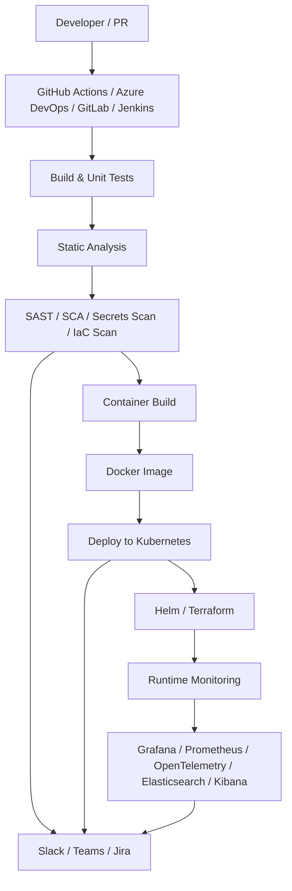

# DevSecOps Integration — Projeto de Arquitetura

## 1. Objetivo

Este documento projeta a integração completa do Security QA MCP em um pipeline DevSecOps enterprise, cobrindo automação de build, testes, segurança, implantação, observabilidade e comunicação entre times.

O fluxo deve permitir que código, infraestrutura e aplicações sejam validados com segurança desde o início do ciclo de vida, com rastreabilidade, governança e integração com ferramentas populares de engenharia.

---

## 2. Objetivos da integração

- Automatizar validação de código, testes e segurança em pipelines
- Integrar scanners de segurança em todas as etapas relevantes
- Implantar artefatos com padrão seguro em containers e Kubernetes
- Gerar evidências e rastreabilidade para auditoria
- Centralizar observabilidade e alertas operacionais
- Integrar comunicação com times via Slack, Teams e Jira

---

## 3. Visão arquitetural

A integração DevSecOps será organizada em quatro camadas:

1. Source & Delivery
2. CI/CD Execution
3. Security & Quality Gates
4. Runtime & Observability



---

## 4. Ferramentas propostas

### 4.1 CI/CD

- GitHub Actions
- Azure DevOps
- GitLab CI/CD
- Jenkins

### 4.2 Containerização e entrega

- Docker
- Kubernetes
- Helm
- Terraform

### 4.3 Segurança e qualidade

- SonarQube
- SAST
- SCA
- Secret scanning
- IaC scanning
- Container scanning
- DAST opcional

### 4.4 Observabilidade

- Prometheus
- Grafana
- OpenTelemetry
- Elasticsearch
- Kibana

### 4.5 Colaboração e rastreabilidade

- Slack
- Teams
- Jira

---

## 5. Fluxo completo do pipeline

### 5.1 Trigger inicial

O pipeline é iniciado por:

- push para branch principal
- pull request
- merge request
- tag de release
- manual dispatch

### 5.2 Etapa 1 — Checkout e integração

Ações:
- Baixar código do repositório
- Restaurar dependências
- Validar ambiente
- Configurar variáveis secretas

Ferramentas:
- GitHub Actions, Azure DevOps, GitLab CI/CD ou Jenkins

### 5.3 Etapa 2 — Build e testes

Ações:
- Compilar aplicação
- Executar testes unitários e de integração
- Validar contratos e schemas
- Gerar artefatos de build

Saídas:
- artefatos binários
- relatórios de testes
- cobertura

### 5.4 Etapa 3 — Qualidade estática

Ações:
- SonarQube para análise de qualidade e segurança de código
- Verificação de duplicação, vulnerabilidades e hotspots
- Falha de pipeline em caso de violação de gate

Objetivo:
- garantir qualidade mínima antes da entrega

### 5.5 Etapa 4 — Segurança contínua

Ações:
- varredura de dependências
- análise de segredos
- análise de infraestrutura como código
- varredura de imagens Docker
- análise de vulnerabilidades em componentes

Ferramentas sugeridas:
- Snyk, Trivy, Grype, Semgrep, Gitleaks, Dependency Check, Checkov

Regras:
- falha o pipeline para severidade crítica
- gera evidências e relatório de segurança

### 5.6 Etapa 5 — Containerização

Ações:
- construir imagem Docker
- assinar imagem
- aplicar tags de versão e ambiente
- publicar no registry

Saída:
- imagem pronta para deploy

### 5.7 Etapa 6 — Infraestrutura como código

Ações:
- executar `terraform init`, `terraform plan` e `terraform apply`
- validar estado da infraestrutura
- aplicar políticas de segurança e conformidade

Objetivo:
- garantir que a infraestrutura siga padrões seguros e reprodutíveis

### 5.8 Etapa 7 — Implantação no Kubernetes

Ações:
- empacotar manifests com Helm
- aplicar valores por ambiente
- realizar rollout seguro
- validar readiness e liveness probes

Fluxo:
- dev → staging → production

### 5.9 Etapa 8 — Observabilidade e pós-deploy

Ações:
- coletar métricas com Prometheus
- centralizar logs com Elasticsearch/Kibana
- instrumentar com OpenTelemetry
- visualizar dashboards no Grafana

Objetivo:
- detectar problemas rapidamente e obter contexto para incident response

### 5.10 Etapa 9 — Comunicação e rastreabilidade

Ações:
- publicar status no Slack ou Teams
- criar/atualizar ticket no Jira
- associar evidências e relatórios aos artefatos

---

## 6. Fluxo detalhado por ferramenta

### 6.1 GitHub Actions

Uso:
- pipeline nativo para CI/CD no GitHub
- execução em pull requests e branches principais

Exemplo de estágio:

```yaml
name: devsecops-pipeline
on:
  pull_request:
  push:
    branches: [main]

jobs:
  build:
    runs-on: ubuntu-latest
    steps:
      - uses: actions/checkout@v4
      - run: npm ci
      - run: npm test
      - run: npm run lint
```

### 6.2 Azure DevOps

Uso:
- pipelines YAML com controle de artefatos, ambientes e approvals
- integração com repositórios e boards

Cenário:
- pipeline de build e validation
- deployment approval para staging e production

### 6.3 GitLab

Uso:
- CI/CD nativo com `gitlab-ci.yml`
- integração com container registry e Kubernetes

### 6.4 Jenkins

Uso:
- pipelines declarativos ou scripted
- integração com agentes e runners próprios

---

## 7. Pipeline seguro sugerido

```text
Developer Commit
   ↓
Pull Request / Merge Request
   ↓
Validate code and dependencies
   ↓
Run unit/integration tests
   ↓
Run SAST / SCA / Secret Scan / IaC Scan
   ↓
Run SonarQube quality gate
   ↓
Build Docker image
   ↓
Scan container image
   ↓
Publish image to registry
   ↓
Deploy via Helm to Kubernetes
   ↓
Run smoke tests
   ↓
Emit telemetry and logs
   ↓
Notify Slack / Teams / Jira
```

---

## 8. Gates de segurança

### 8.1 Gate de código

- build bem-sucedido
- testes passando
- cobertura mínima
- análise estática sem bloqueios severos

### 8.2 Gate de dependência

- nenhuma vulnerabilidade crítica não tratada
- dependências com risco conhecido tratadas

### 8.3 Gate de container

- imagem sem vulnerabilidades críticas
- assinatura e rastreabilidade garantidas

### 8.4 Gate de infraestrutura

- Terraform válido
- política de segurança atendida
- ambiente aprovado

### 8.5 Gate de runtime

- health checks ativos
- métricas esperadas
- logs e traces disponíveis

---

## 9. Observabilidade proposta

### 9.1 Métricas

- latência
- taxa de erro
- throughput
- disponibilidade
- consumo de recursos
- taxa de segurança por release

### 9.2 Logs

- logs de aplicação
- logs de pipeline
- logs de deploy
- logs de segurança

### 9.3 Traces

- rastreio distribuído com OpenTelemetry
- correlação entre request, serviço e infraestrutura

### 9.4 Dashboards

- Grafana para visão operacional
- Prometheus para métricas
- Elasticsearch/Kibana para logs e análise

---

## 10. Integração com comunicação e rastreabilidade

### Slack / Teams

- envio de notificações de sucesso, falha e risco
- alertas críticos para times relevantes

### Jira

- criação automática de tickets para vulnerabilidades críticas
- rastreio de remediação e status

---

## 11. Estrutura sugerida de pipeline

```text
.github/workflows/
  ci.yml
  security.yml
  release.yml
  deploy.yml

azure-pipelines.yml

.gitlab-ci.yml

jenkins/Jenkinsfile

docker/
  Dockerfile

helm/
  charts/
    app/

terraform/
  environments/
    dev/
    staging/
    prod/
```

---

## 12. Estratégia de implementação incremental

### Fase 1

- CI básico com build e testes
- integração com GitHub Actions ou Azure DevOps
- publicação de artefatos

### Fase 2

- SonarQube
- análise de dependências e segredos
- container scan

### Fase 3

- deploy com Helm no Kubernetes
- Terraform para infraestrutura
- observabilidade com Prometheus/Grafana/OpenTelemetry

### Fase 4

- integração com Slack/Teams/Jira
- dashboards executivos e técnicos
- gates avançados de segurança

---

## 13. Conclusão

A integração DevSecOps proposta transforma o Security QA MCP em uma plataforma de engenharia segura, automatizada e observável. O pipeline cobre desde a validação do código até a operação em produção, garantindo que segurança, qualidade e governança sejam incorporadas contínua e sistematicamente no ciclo de desenvolvimento.
